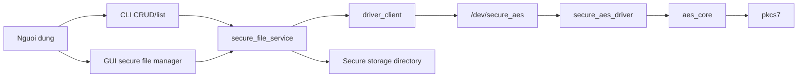

# Phan Tich Du An Secure File Manager

## 1. Muc tieu moi cua du an

Du an khong con la mot cong cu encrypt/decrypt file tuy y tren filesystem nua.
No da duoc chuyen thanh:

- mot chuong trinh **quan ly file co bao mat**
- co **kho luu tru rieng**
- ho tro **tao, doc, sua, xoa, liet ke file**
- du lieu luon duoc **ma hoa khi luu**
- du lieu duoc **giai ma khi doc**
- AES duoc thuc hien trong **driver kernel** dua tren **Kernel Crypto API**

## 2. Kien truc tong quat



## 3. Thanh phan chinh

### 3.1 `driver/`

- `secure_aes_driver.c`
  - tao character device `/dev/secure_aes`
  - quan ly session theo tung `open()`
  - nhan config qua `ioctl`
  - nhan input qua `write()`
  - tra output qua `read()`

- `aes_core.c`
  - goi Linux Kernel Crypto API voi transform `cbc(aes)`

- `pkcs7.c`
  - them va bo PKCS#7 padding

- `ioctl_defs.h`
  - dinh nghia ioctl, mode, config, status

### 3.2 `app/`

- `main.c`
  - CLI cho `list`, `create`, `update`, `read`, `delete`

- `gui_main.c`
  - giao dien GTK3
  - hien danh sach secure file
  - cho phep mo, sua, luu, xoa file trong secure storage

- `secure_file_service.c`
  - trung tam nghiep vu cua user-space
  - quan ly secure storage
  - tao IV ngau nhien
  - dong goi/phan tich encrypted file format
  - goi driver de encrypt/decrypt buffer

- `driver_client.c`
  - giao tiep truc tiep voi `/dev/secure_aes`

- `file_io.c`
  - doc/ghi buffer ra file

- `hex_utils.c`
  - parse AES key dang hex

## 4. Kho luu tru rieng

Mac dinh, file duoc luu trong:

```text
~/.secure_file_manager_storage
```

Muc dich:

- tach kho secure file khoi filesystem lam viec thong thuong
- dam bao chuong trinh co mot noi luu tru rieng dung de tai
- GUI chi hien danh sach file trong kho nay

Moi secure file duoc luu thanh:

```text
<ten_file>.saes
```

## 5. Dinh dang file luu tren dia

Moi file trong kho rieng khong phai plaintext.
No co cau truc:

1. `magic` de nhan dien secure file format
2. `IV` 16 byte
3. `ciphertext`

Y nghia:

- khi luu, app sinh IV ngau nhien roi gui plaintext + key + IV cho driver
- khi doc, app doc lai IV tu file va gui ciphertext + key + IV cho driver de giai ma

## 6. Luong xu ly khi luu file

1. Nguoi dung tao file moi hoac sua noi dung file trong GUI/CLI.
2. App nhan plaintext trong RAM.
3. App parse AES key dang hex.
4. App sinh IV ngau nhien.
5. App goi driver:
   - `SET_CONFIG`
   - `write()`
   - `PROCESS`
   - `GET_STATUS`
   - `read()`
6. App nhan ciphertext.
7. App ghi `header + IV + ciphertext` vao secure storage.

## 7. Luong xu ly khi doc file

1. App doc secure file trong kho rieng.
2. App kiem tra `magic`.
3. App lay IV tu header.
4. App goi driver de giai ma ciphertext.
5. App nhan plaintext trong RAM.
6. App:
   - hien len GUI editor, hoac
   - ghi ra file/`stdout` trong CLI.

## 8. Cac chuc nang hien co

### 8.1 Tao file

- GUI: bam `New File`, nhap ten file, nhap noi dung, `Save Encrypted`
- CLI: `create`

### 8.2 Doc file

- GUI: chon file trong danh sach, bam `Open`
- CLI: `read`

### 8.3 Sua file

- GUI: mo file, sua editor, luu lai
- CLI: `update`

### 8.4 Xoa file

- GUI: chon file, bam `Delete`
- CLI: `delete`

### 8.5 Liet ke tat ca file

- GUI: bang danh sach secure file trong panel trai
- CLI: `list`

## 9. Vi sao du an nay khop de tai hon ban cu

Ban cu:

- chu yeu la cong cu encrypt/decrypt file nguon -> file dich
- thao tac tren file tuy y ngoai filesystem
- chua co kho luu tru rieng va CRUD thuc su

Ban moi:

- co secure storage rieng
- co danh sach file dang co
- co tao/doc/sua/xoa
- moi du lieu luu tren dia deu di qua driver AES
- phan quan ly file tro thanh chuc nang trung tam cua ung dung

## 10. Gioi han hien tai

- Driver xu ly toi da 8 MiB moi request.
- GUI hien tai huong den file text UTF-8.
- Khoa AES do nguoi dung cung cap; du an chua co co che quan ly key la mot bai toan rieng.

## 11. Kiem thu

`tests/verify.sh` da duoc doi de test dung mo hinh moi:

- create secure file
- list
- read/decrypt
- update
- delete
- kiem tra file luu tren dia khong phai plaintext
