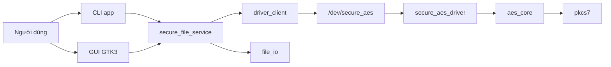
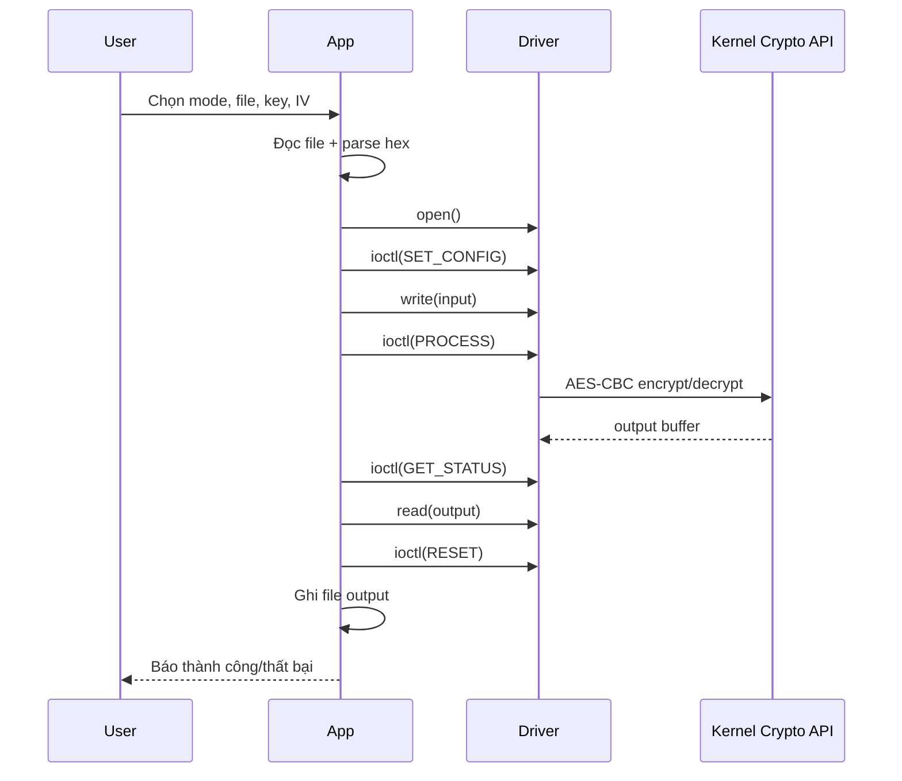

# Phân Tích Chi Tiết Dự Án Secure File Manager

## 1. Mục tiêu dự án

Dự án này xây dựng một hệ thống mã hóa và giải mã file trên Linux theo mô hình tách lớp:

- `driver/`: kernel module tạo character device `/dev/secure_aes` và thực hiện AES-CBC trong kernel.
- `app/`: ứng dụng user-space gồm CLI và GUI GTK3 để đọc file, gửi dữ liệu sang driver, nhận kết quả và ghi file đầu ra.
- `scripts/`: script build, nạp driver, chạy demo, chạy GUI.
- `tests/`: kiểm tra end-to-end việc encrypt rồi decrypt có khôi phục đúng nội dung ban đầu hay không.

Điểm quan trọng của dự án là: user-space không tự cài AES mà chỉ điều khiển driver qua `ioctl`, `write`, `read`.

## 2. Kiến trúc tổng thể

Luồng kiến trúc tổng quát:



## 3. Vai trò từng thư mục

### 3.1 `app/`

Đây là phần user-space.

- `main.c`: entry point cho CLI.
- `gui_main.c`: entry point cho GUI GTK3.
- `secure_file_service.c`: lớp nghiệp vụ chính để xử lý một yêu cầu encrypt/decrypt.
- `driver_client.c`: lớp giao tiếp trực tiếp với device `/dev/secure_aes`.
- `file_io.c`: đọc toàn bộ file input và ghi toàn bộ file output.
- `hex_utils.c`: parse key/IV dạng hex sang mảng byte.
- `file_manager.c`: logic duyệt thư mục, tạo folder, xóa file/folder cho GUI.

### 3.2 `driver/`

Đây là phần kernel-space.

- `secure_aes_driver.c`: character device driver, quản lý session theo mỗi lần `open()`.
- `aes_core.c`: thực hiện AES-CBC thông qua Linux Kernel Crypto API (`cbc(aes)`).
- `pkcs7.c`: thêm và bỏ padding PKCS#7.
- `ioctl_defs.h`: định nghĩa device name, hằng số chung, struct config/status và mã `ioctl`.

### 3.3 `scripts/`

- `build_all.sh`: build driver và app.
- `load_driver.sh`: nạp module và kiểm tra/tạo `/dev/secure_aes`.
- `run_demo.sh`: build, load driver, chạy test.
- `run_gui.sh`: mở GUI.
- `unload_driver.sh`: gỡ module.
- `install_deps_zorin.sh`, `install_launcher.sh`: hỗ trợ môi trường desktop.

### 3.4 `tests/`

- `verify.sh`: kiểm tra encrypt/decrypt end-to-end bằng CLI.
- `sample.txt`: file mẫu để test.

## 4. Hai khối chính của hệ thống

### 4.1 User-space

User-space có nhiệm vụ:

- nhận input từ người dùng;
- kiểm tra tham số;
- đọc nội dung file vào RAM;
- gửi mode, key, IV và buffer sang driver;
- nhận buffer kết quả từ driver;
- ghi kết quả ra file đầu ra;
- hiển thị trạng thái cho CLI hoặc GUI.

User-space không giữ trách nhiệm mã hóa AES.

### 4.2 Kernel-space

Driver có nhiệm vụ:

- tạo device `/dev/secure_aes`;
- nhận cấu hình AES qua `ioctl`;
- nhận dữ liệu đầu vào qua `write()`;
- xử lý dữ liệu khi nhận `SECURE_AES_IOCTL_PROCESS`;
- trả dữ liệu kết quả qua `read()`;
- báo trạng thái qua `SECURE_AES_IOCTL_GET_STATUS`;
- reset session qua `SECURE_AES_IOCTL_RESET`.

## 5. Các cấu trúc dữ liệu quan trọng

### 5.1 Cấu hình truyền từ app sang driver

Trong `driver/ioctl_defs.h`:

- `struct secure_aes_config`
  - `mode`: encrypt hoặc decrypt.
  - `key_len`: 16, 24 hoặc 32 byte.
  - `key`: buffer chứa key AES.
  - `iv`: IV 16 byte.

- `struct secure_aes_status`
  - `input_len`: số byte input hiện có trong session.
  - `output_len`: số byte output sau xử lý.
  - `config_set`: đã set config hay chưa.
  - `processed`: đã xử lý xong hay chưa.

### 5.2 Session trong driver

Mỗi lần app `open("/dev/secure_aes", O_RDWR)` sẽ tạo một `secure_aes_session` riêng trong `driver/secure_aes_driver.c`.

Session giữ:

- mutex để đồng bộ;
- cờ `config_set`;
- cờ `processed`;
- `params`: mode, key, IV;
- `input_buf`, `input_len`;
- `output_buf`, `output_len`, `output_offset`.

Điều này giúp session tách biệt theo file descriptor. Hai tiến trình khác nhau hoặc hai lần `open()` khác nhau không dùng chung trạng thái.

## 6. Luồng xử lý tổng quát end-to-end

Luồng đầy đủ khi encrypt/decrypt:

1. Người dùng nhập tham số trên CLI hoặc GUI.
2. App chuyển text mode thành hằng số nội bộ.
3. App parse key hex và IV hex thành byte array.
4. App đọc toàn bộ file input vào bộ nhớ.
5. App mở `/dev/secure_aes`.
6. App gửi cấu hình AES qua `SECURE_AES_IOCTL_SET_CONFIG`.
7. App `write()` toàn bộ dữ liệu input vào driver.
8. App gọi `SECURE_AES_IOCTL_PROCESS`.
9. Driver chạy AES-CBC trong kernel.
10. App gọi `SECURE_AES_IOCTL_GET_STATUS` để lấy độ dài output.
11. App `read()` toàn bộ output đã xử lý từ driver.
12. App ghi output ra file đích.
13. App reset session bằng `SECURE_AES_IOCTL_RESET` rồi đóng device.

## 7. Luồng hoạt động của CLI

File chính: `app/main.c`.

### 7.1 Cách CLI nhận tham số

CLI hỗ trợ:

```bash
./app/secure_file_app encrypt <input> <output> --key <hex> --iv <hex>
./app/secure_file_app decrypt <input> <output> --key <hex> --iv <hex>
```

`main.c` thực hiện:

- đọc `argv[1]` để xác định mode;
- lấy `argv[2]` và `argv[3]` làm input/output path;
- đọc các cờ `--key`, `--iv`, tùy chọn `--device`;
- gọi `secure_file_process_request()`.

### 7.2 Vai trò của `secure_file_process_request()`

Đây là trung tâm xử lý phía user-space, nằm ở `app/secure_file_service.c`.

Hàm này thực hiện lần lượt:

1. Kiểm tra request có đủ trường không.
2. Kiểm tra mode hợp lệ.
3. Kiểm tra input và output không trỏ vào cùng một file.
4. Parse key hex.
5. Kiểm tra key phải dài đúng 16/24/32 byte.
6. Parse IV hex đúng 16 byte.
7. Đọc toàn bộ file input bằng `read_entire_file()`.
8. Gọi `secure_aes_process_buffer()` để làm việc với driver.
9. Ghi dữ liệu output bằng `write_entire_file()`.
10. Trả về kích thước input/output cho caller.

### 7.3 Kiểm tra input/output trùng nhau

Hàm `secure_file_paths_match()` không chỉ so sánh chuỗi đường dẫn, mà còn dùng `stat()` để so sánh `st_dev` và `st_ino`.

Ý nghĩa:

- tránh trường hợp hai đường dẫn khác tên nhưng thực chất cùng trỏ tới một file;
- tránh ghi đè lên chính file nguồn.

## 8. Luồng hoạt động của GUI

File chính: `app/gui_main.c`.

GUI chia thành 2 panel:

- bên trái là file browser;
- bên phải là form thực hiện secure AES operation.

### 8.1 Thành phần giao diện chính

GUI state gồm:

- `directory_entry`: thư mục hiện tại;
- `tree_view` + `list_store`: danh sách file/thư mục;
- `input_entry`, `output_entry`, `device_entry`;
- `mode_combo`;
- `key_entry`, `iv_entry`;
- `status_label`;
- `log_view`, `log_buffer`;
- các nút `Use Selected`, `Delete`, `Process`.

### 8.2 Luồng file browser

Khi GUI khởi động:

1. `on_activate()` gọi `build_gui()`.
2. Giao diện được dựng bằng GTK3.
3. `current_directory` mặc định là thư mục home.
4. `gui_populate_directory()` nạp danh sách file/thư mục.

`gui_populate_directory()` thực hiện:

1. Chuẩn hóa đường dẫn thư mục bằng `file_manager_normalize_directory()`.
2. Lấy danh sách entries bằng `file_manager_list_directory()`.
3. Sắp xếp entries: folder trước, sau đó đến file, theo thứ tự chữ cái không phân biệt hoa thường.
4. Hiển thị lên `GtkTreeView`.

### 8.3 Các thao tác chính trên GUI

- Double-click vào folder:
  - `gui_use_selected_item()` mở thư mục đó.
- Chọn file:
  - đưa đường dẫn vào ô input;
  - tự gợi ý output nếu cần.
- `Browse File`:
  - chọn input qua file chooser.
- `Choose Output`:
  - chọn file output qua file chooser.
- `Suggest Output`:
  - tạo tên output tự động.
- `New Folder`:
  - gọi `file_manager_create_directory()`.
- `Delete Selected`:
  - gọi `file_manager_delete_path()`, hỗ trợ xóa đệ quy với thư mục.
- `Process via Driver`:
  - gom dữ liệu trên form thành `secure_file_request`;
  - gọi `secure_file_process_request()`;
  - cập nhật status và log.

### 8.4 Cơ chế gợi ý tên output

Hàm `secure_file_suggest_output_path()`:

- nếu mode là encrypt: thêm `.enc` vào cuối tên file;
- nếu mode là decrypt:
  - nếu input kết thúc bằng `.enc` thì bỏ `.enc`;
  - nếu không thì thêm `.restored`.

Ví dụ:

- `a.txt` encrypt -> `a.txt.enc`
- `a.txt.enc` decrypt -> `a.txt`
- `cipher.bin` decrypt -> `cipher.bin.restored`

### 8.5 Logging trong GUI

GUI ghi log thao tác bằng `gui_append_log()`:

- gắn timestamp;
- append vào `GtkTextBuffer`;
- auto-scroll xuống cuối.

GUI có hai lớp phản hồi:

- `status_label`: phản hồi trạng thái hiện tại, màu xanh hoặc đỏ;
- `Operation Log`: lịch sử thao tác chi tiết.

## 9. Cách user-space giao tiếp với driver

Phần này nằm chủ yếu ở `app/driver_client.c`.

Hàm chính: `secure_aes_process_buffer()`.

Luồng xử lý:

1. Tạo `secure_aes_config`.
2. `open(device_path, O_RDWR)`.
3. `ioctl(fd, SECURE_AES_IOCTL_SET_CONFIG, &config)`.
4. Nếu có input thì `write_all(fd, input, input_len)`.
5. `ioctl(fd, SECURE_AES_IOCTL_PROCESS)`.
6. `ioctl(fd, SECURE_AES_IOCTL_GET_STATUS, &status)`.
7. Dựa vào `status.output_len` để cấp phát bộ nhớ.
8. `read_all(fd, result, status.output_len)`.
9. `ioctl(fd, SECURE_AES_IOCTL_RESET)`.
10. `close(fd)`.

### 9.1 Tại sao lại cần `GET_STATUS`

Do app không biết trước output dài bao nhiêu byte:

- encrypt: output có thể dài hơn input do padding;
- decrypt: output có thể ngắn hơn input sau khi bỏ padding.

Vì vậy app hỏi driver trước để biết chính xác `output_len`.

### 9.2 Vì sao có `RESET`

`RESET` giúp:

- xóa input buffer và output buffer của session;
- xóa key/IV trong session;
- đưa session về trạng thái sạch trước khi `close()`.

Trong thực tế `release()` khi đóng file cũng dọn dẹp, nhưng client vẫn chủ động reset trước để kiểm soát vòng đời dữ liệu nhạy cảm rõ ràng hơn.

## 10. Cách driver hoạt động chi tiết

File chính: `driver/secure_aes_driver.c`.

### 10.1 Khởi tạo module

Khi module được load:

1. `alloc_chrdev_region()` cấp số major/minor.
2. `cdev_init()` và `cdev_add()` đăng ký character device.
3. `class_create()` tạo class.
4. `device_create()` tạo node device `secure_aes`.
5. `devnode` đặt quyền `0666`.

Kết quả là hệ thống có device `/dev/secure_aes`.

### 10.2 Khi app mở device

`secure_aes_open()`:

- cấp phát một `secure_aes_session` bằng `kzalloc`;
- khởi tạo mutex;
- gán session vào `filp->private_data`.

Điểm này rất quan trọng: mỗi file descriptor có session riêng.

### 10.3 Khi app gọi `SET_CONFIG`

Driver:

1. copy `secure_aes_config` từ user-space bằng `copy_from_user()`;
2. kiểm tra `mode` và `key_len`;
3. lock mutex của session;
4. reset IO buffer cũ;
5. xóa sạch `params` cũ;
6. copy mode, key, IV vào `session->params`;
7. đặt `config_set = true`.

Lưu ý:

- `SET_CONFIG` sẽ xóa dữ liệu input/output cũ của session;
- thao tác này chuẩn bị session cho một request mới.

### 10.4 Khi app `write()`

`secure_aes_write()`:

1. kiểm tra session hợp lệ;
2. không cho ghi nếu chưa `SET_CONFIG`;
3. kiểm tra tổng dung lượng không vượt `SECURE_AES_MAX_BUFFER_SIZE` là 8 MiB;
4. copy dữ liệu từ user-space vào buffer kernel tạm;
5. `krealloc()` để mở rộng `input_buf`;
6. append dữ liệu mới vào `session->input_buf`;
7. tăng `input_len`;
8. xóa output cũ nếu có, vì input đã thay đổi.

Như vậy driver hỗ trợ nhiều lần `write()` nối tiếp để gom thành một buffer input lớn, miễn tổng kích thước không vượt 8 MiB.

### 10.5 Khi app gọi `PROCESS`

`SECURE_AES_IOCTL_PROCESS`:

1. khóa mutex;
2. kiểm tra đã có config chưa;
3. nếu decrypt mà `input_len == 0` thì trả `-ENODATA`;
4. xóa output cũ;
5. gọi `aes_cbc_process_buffer()`;
6. nếu thành công:
   - `processed = true`;
   - `output_offset = 0`;
7. nếu thất bại:
   - `processed = false`.

### 10.6 Khi app gọi `GET_STATUS`

Driver copy sang user-space các thông tin:

- đã set config chưa;
- đã process chưa;
- input_len hiện tại;
- output_len hiện tại.

### 10.7 Khi app `read()`

`secure_aes_read()`:

1. kiểm tra session đã `processed` và có `output_buf`;
2. tính số byte còn lại chưa đọc;
3. copy từng phần sang user-space;
4. tăng `output_offset`.

Nếu đọc hết rồi, `read()` trả `0`.

### 10.8 Khi app `RESET` hoặc đóng device

- `RESET` gọi `secure_aes_reset_session()`.
- `release()` cũng gọi reset rồi `kfree(session)`.

Việc reset gồm:

- xóa `input_buf`;
- xóa `output_buf`;
- `memzero_explicit()` trên `params`;
- `config_set = false`;
- `processed = false`.

Đây là điểm tốt về bảo mật vì key và dữ liệu nhạy cảm được xóa trước khi giải phóng bộ nhớ.

## 11. Cách mã hóa AES-CBC được thực hiện trong kernel

Phần này nằm ở `driver/aes_core.c`.

### 11.1 Chuẩn bị dữ liệu

Nếu mode là encrypt:

- gọi `pkcs7_pad_alloc()` để thêm padding theo block size 16 byte;
- `crypt_len` sẽ là độ dài sau padding.

Nếu mode là decrypt:

- input phải khác rỗng;
- input phải chia hết cho 16;
- copy input vào buffer kernel để giải mã.

### 11.2 Sử dụng Linux Kernel Crypto API

Driver không tự cài thuật toán AES bằng tay mà dùng:

- `crypto_alloc_skcipher("cbc(aes)", 0, 0)`
- `crypto_skcipher_setkey()`
- `skcipher_request_alloc()`
- `skcipher_request_set_crypt()`
- `crypto_skcipher_encrypt()` hoặc `crypto_skcipher_decrypt()`

Điều này giúp:

- giảm độ phức tạp khi tự viết AES;
- tận dụng hạ tầng crypto sẵn có của kernel;
- vẫn đảm bảo AES thực thi trong kernel-space.

### 11.3 Xử lý sau giải mã

Nếu mode là decrypt:

- driver gọi `pkcs7_unpad_inplace()` để kiểm tra và bỏ padding;
- nếu padding không hợp lệ thì trả `-EBADMSG`.

Điều này thường xảy ra khi:

- key sai;
- IV sai;
- ciphertext hỏng;
- hoặc dữ liệu đầu vào không đúng định dạng PKCS#7.

## 12. Cách PKCS#7 hoạt động trong dự án

### 12.1 Padding khi encrypt

`pkcs7_pad_alloc()`:

- tính số byte padding cần thêm;
- luôn thêm ít nhất 1 block padding nếu input chia hết block size;
- ví dụ block size là 16:
  - input dài 14 -> thêm 2 byte `0x02 0x02`
  - input dài 16 -> thêm hẳn 16 byte `0x10`

### 12.2 Unpadding khi decrypt

`pkcs7_unpad_inplace()`:

1. lấy byte cuối làm `pad_len`;
2. kiểm tra `pad_len` hợp lệ;
3. kiểm tra tất cả `pad_len` byte cuối có cùng giá trị đó không;
4. nếu hợp lệ thì `output_len = input_len - pad_len`.

Nếu không hợp lệ thì trả `-EBADMSG`.

## 13. Vai trò của `file_manager.c` trong GUI

Module này không liên quan đến AES, nhưng là phần hạ tầng quan trọng cho GUI.

Nó cung cấp:

- chuẩn hóa thư mục bằng `realpath()`;
- liệt kê thư mục bằng `opendir()/readdir()/lstat()`;
- gán nhãn loại entry: file, directory, symlink, device...;
- tạo thư mục mới;
- xóa file/folder đệ quy;
- lấy thư mục cha;
- kiểm tra path là file thường hay thư mục.

### 13.1 Sắp xếp danh sách

Khi list thư mục:

- thư mục được đưa lên trước;
- file đi sau;
- tên được sắp theo `strcasecmp()`.

Điều này làm file browser dễ dùng hơn.

### 13.2 Xóa đệ quy

`file_manager_delete_path_internal()`:

- nếu là thư mục, nó đi đệ quy vào từng phần tử con rồi xóa;
- nếu là file thì `unlink()`;
- cuối cùng `rmdir()` thư mục rỗng.

Nghĩa là nút xóa trong GUI có khả năng xóa toàn bộ cây thư mục.

## 14. Quản lý lỗi trong dự án

### 14.1 Mapping lỗi ở user-space

`secure_file_describe_error()` chuyển các mã lỗi phổ biến thành thông điệp dễ hiểu:

- `E2BIG`: file vượt giới hạn 8 MiB;
- `EBADMSG`: sai padding hoặc sai key/IV;
- `ENODATA`: decrypt khi driver chưa có data;
- `ENOTTY`: ioctl không hỗ trợ;
- `ENOENT`: thiếu file hoặc device;
- `EACCES` / `EPERM`: thiếu quyền;
- `EINVAL`: tham số không hợp lệ.

### 14.2 Cách lỗi đi qua hệ thống

Ví dụ:

1. kernel trả lỗi âm như `-EBADMSG`;
2. `driver_client.c` nhận lỗi âm từ `ioctl` hoặc `read/write`;
3. `secure_file_service.c` đổi về lỗi dương phía user-space;
4. CLI in lỗi ra `stderr`;
5. GUI đưa lỗi lên `status_label` và `Operation Log`.

## 15. Build và chạy dự án

### 15.1 Build

`scripts/build_all.sh`:

1. kiểm tra đường dẫn project không chứa dấu cách;
2. `make -C driver`;
3. `make -C app`.

Điểm đáng chú ý:

- script cảnh báo build kernel module từ đường dẫn có khoảng trắng là không ổn định;
- môi trường hiện tại của project đang nằm trong đường dẫn có dấu cách, nên đây là một rủi ro vận hành thực tế.

### 15.2 Nạp driver

`scripts/load_driver.sh`:

1. kiểm tra file `.ko` đã tồn tại chưa;
2. nếu module chưa load thì `sudo insmod`;
3. nếu `/dev/secure_aes` chưa tự tạo, script tự tìm major number từ `/proc/devices`;
4. dùng `mknod` và `chmod 666`.

Script cũng có nhánh chẩn đoán Secure Boot nếu module bị từ chối.

### 15.3 Chạy GUI

`scripts/run_gui.sh`:

- kiểm tra binary GUI tồn tại;
- cảnh báo nếu `/dev/secure_aes` chưa có;
- `exec` trực tiếp `app/secure_file_gui`.

### 15.4 Kiểm thử

`tests/verify.sh`:

1. tạo thư mục tạm;
2. encrypt `tests/sample.txt`;
3. decrypt file vừa mã hóa;
4. so sánh file gốc và file phục hồi bằng `cmp -s`.

Nếu giống nhau thì test pass.

## 16. Đặc điểm thiết kế nổi bật

### 16.1 Tách rõ frontend, service, driver

Thiết kế hiện tại khá sạch:

- CLI và GUI đều dùng chung `secure_file_service.c`;
- service dùng `driver_client.c` để nói chuyện với driver;
- driver giữ toàn bộ logic AES thực sự.

Điều này giúp tránh duplicate logic giữa CLI và GUI.

### 16.2 Session theo file descriptor

Đây là quyết định thiết kế tốt vì:

- cô lập trạng thái giữa các request;
- đơn giản hóa đồng bộ;
- dễ giải thích trong báo cáo môn học;
- phù hợp mô hình character device.

### 16.3 Xóa dữ liệu nhạy cảm

Project có chủ đích xóa dữ liệu nhạy cảm:

- driver dùng `memzero_explicit()` với key, IV, input/output buffer;
- session được reset trước khi giải phóng.

Đây là điểm cộng về mặt an toàn bộ nhớ.

## 17. Giới hạn hiện tại của dự án

### 17.1 Xử lý one-shot in-memory

Hệ thống hiện tại không stream file theo block từ đầu đến cuối mà:

- đọc toàn bộ file vào RAM ở user-space;
- chép toàn bộ sang RAM ở kernel;
- xử lý xong rồi đọc toàn bộ output về user-space.

Hệ quả:

- tốn bộ nhớ gấp nhiều lần kích thước file;
- không phù hợp file lớn;
- giới hạn mặc định là 8 MiB mỗi request.

### 17.2 Chỉ có tính bí mật, chưa có xác thực

AES-CBC + PKCS#7 chỉ bảo vệ tính bí mật.

Nó chưa bảo vệ tốt:

- tính toàn vẹn;
- tính xác thực nguồn gốc dữ liệu.

Trong thực tế nên dùng:

- AES-GCM;
- hoặc AES-CBC + HMAC.

### 17.3 GUI chạy xử lý trực tiếp trên main thread

Trong `on_process_clicked()`:

- nút process bị disable;
- GUI gọi xử lý đồng bộ;
- có một vòng `while (gtk_events_pending()) gtk_main_iteration();` trước khi chạy.

Điều này chỉ giúp giao diện kịp redraw, nhưng bản chất xử lý vẫn blocking trên main thread. Với file lớn hoặc driver chậm, GUI có thể đơ tạm thời.

### 17.4 Driver cho phép quyền `0666`

Device node được đặt quyền đọc/ghi cho mọi user.

Ưu điểm:

- dễ demo, dễ test.

Nhược điểm:

- không phù hợp môi trường production;
- mọi user local đều có thể dùng device.

## 18. Điểm có thể nhấn mạnh khi thuyết trình hoặc báo cáo

- Đây là mô hình đầy đủ từ GUI/CLI xuống kernel driver.
- AES thực thi trong kernel-space chứ không nằm trong ứng dụng.
- App và driver giao tiếp bằng chuẩn Linux character device.
- Session được quản lý theo mỗi file descriptor.
- Driver hỗ trợ trạng thái xử lý và reset rõ ràng.
- PKCS#7 được kiểm tra khi decrypt.
- GUI chỉ là lớp thao tác thuận tiện, không thay thế driver.

## 19. Tóm tắt luồng hoạt động ngắn gọn

Có thể mô tả hệ thống bằng một câu:

> Người dùng chọn file và tham số trong CLI hoặc GUI, app đọc file vào bộ nhớ, gửi cấu hình và dữ liệu sang `/dev/secure_aes`, driver thực hiện AES-CBC trong kernel, sau đó app đọc kết quả từ driver và ghi thành file đầu ra.

Luồng rút gọn:



## 20. Kết luận

Đây là một dự án có cấu trúc rõ ràng, phù hợp cho mục tiêu học về Linux kernel module, character device, `ioctl`, giao tiếp user-space/kernel-space và tích hợp GUI desktop.

Mấu chốt kỹ thuật của dự án không chỉ nằm ở AES, mà nằm ở toàn bộ pipeline:

- xây dựng device driver;
- quản lý session;
- truyền dữ liệu qua `ioctl/write/read`;
- dùng Linux Kernel Crypto API;
- tổ chức lại thành service dùng chung cho cả CLI và GUI.

Nếu cần mở rộng trong tương lai, hướng hợp lý nhất là:

- chuyển sang xử lý streaming thay vì one-shot in-memory;
- thêm xác thực dữ liệu;
- tách xử lý GUI sang background worker;
- siết quyền truy cập device thay vì `0666`.
